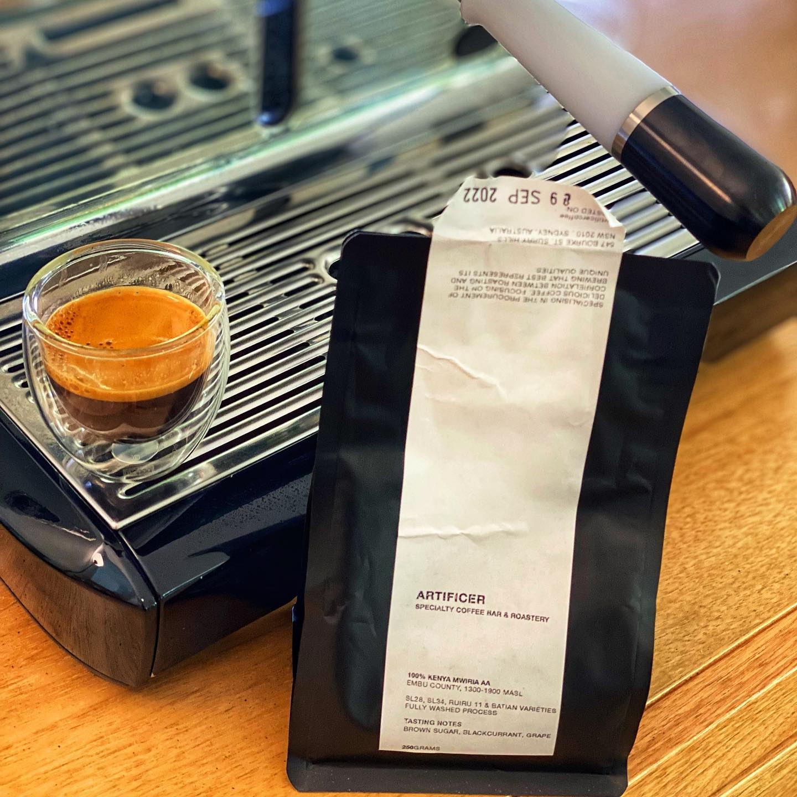

This is the second bag of coffee I bought from @artificercoffee , this is the Kenya Mwiria AA. It’s a washed coffee from Embu County. 

The varietal is listed as SL28, SL34, RUIRU11 and Batian. I have no idea what any of this means! So I need to research some more. 

The tasting notes on this are brown sugar, blackcurrant, and grape. 

This is a super delicious coffee as a straight espresso when I extracted it right. It’s another one that wanted to channel a bunch so I had to take a lot of care with the prep. I also ran this hotter than usual, at 96 degrees. 

The grape and current come through first, and the experience is super sweet. Kinda like a Hi Chew, followed by some brown sugar. It’s really interesting. It’s tricky to get right, some shots were much better than others. 

This didn’t do much for me on milk, it’s definitely for drinking black. 

Fun though!

