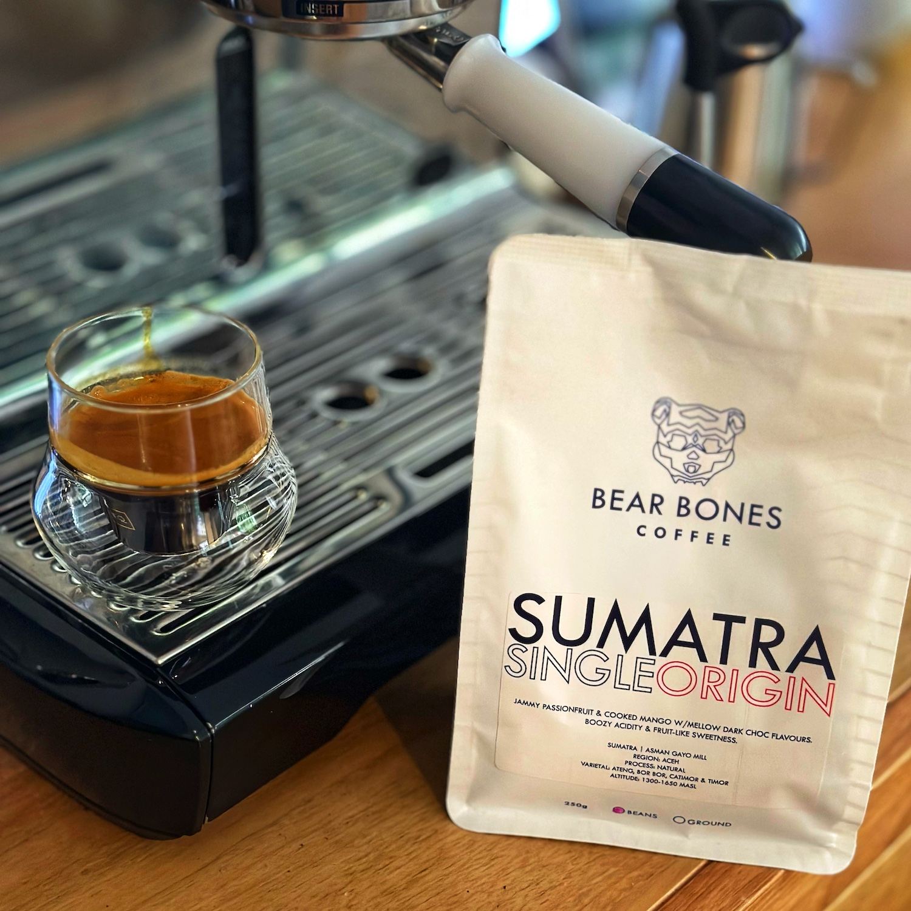

I was recently given this bag of coffee by the owner of my favourite local cafe. I opened it way too early and the first few coffees I had from it weren't super interesting. So I let it sit a week before trying it again.

This is a Single Origin Sumatra from Brisbane's [Bear Bones Coffee](https://bearbones.com.au/). It's a natural process from the Aceh region, and features some varietals I've not come across before: Ateng, Bor Bor, along with Catimor and Timor.

The result is really interesting. It's a super juicy and fruity flavour, nicely acidic, with passionfruit notes.

Super yum, and lovely paired with some biscotti. I've had a few blends from Bear Bones which are usually a little dark for my preferences, but this single origin is lovely.

