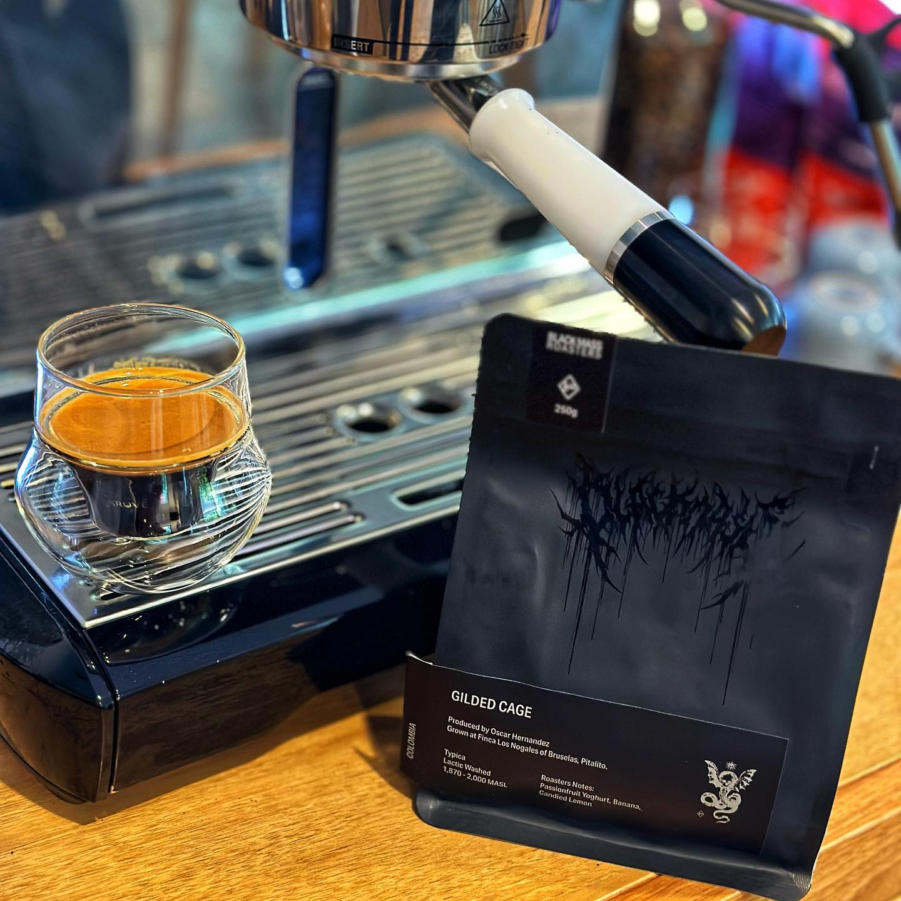

This is another fun one from Black Mass Roasters.

Gilded Cage is a Lactic Washed Typica from Colombia, produced by Oscar Hernandez on the family owned Finca Los Nogales farm in the Huila department.

The larger story behind this farm and coffee is a great one, and you should head to the Black Mass site and read it. It's a great story of innovation, sustainability, organics, and a care for the environment and the coffee.

The coffee has an amazing process: handpicked, thermal shocked, and a long fermentation.

Like most of Black Mass's coffees it's super funky with a fairly well developed roast. Probably too developed for some people's tastes, but it's a signature that I think I could pick blindfolded now.

This has a really funky and fruity hit of passionfruit and yoghurt. The other notes written on the bag — banana and candied lemon — are there too, especially as an aftertaste as the coffee cools down.

I'm enjoying this one a lot.

[Instagram](https://www.instagram.com/p/CwgbgS2hNpO/)

