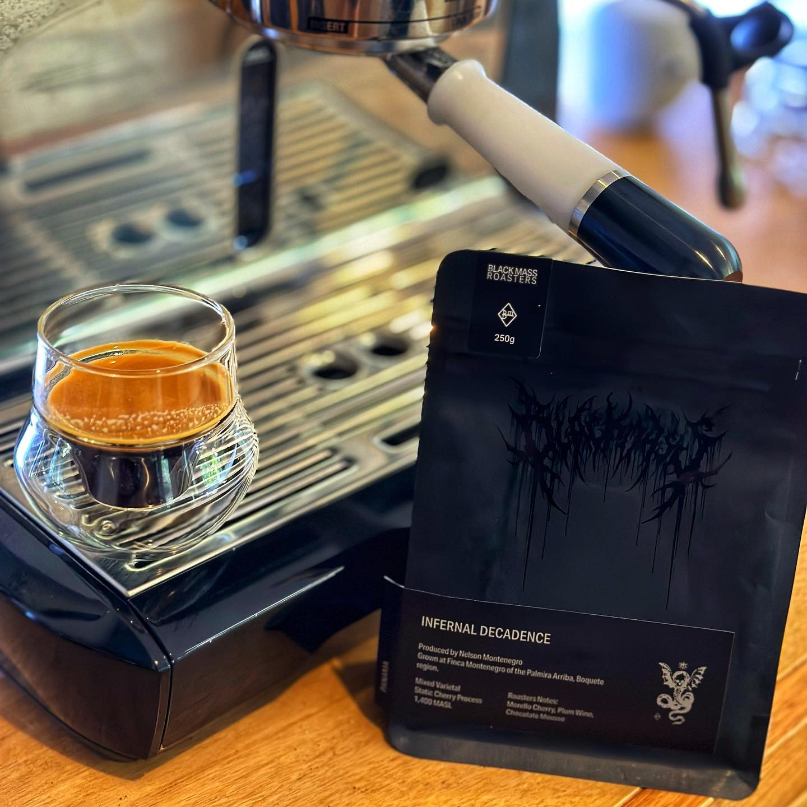

I reckon I could probably pick most @blackmassroasters out of a line up now, and this one is so on brand. 

This is Infernal Decadence from Panama and it’s very much a Black Mass coffee. 

This comes from producer Nelson Montenegro and his Finca Montenegro farm and is processed with an experimental anaerobic process called Static Cherry. The result in the cup is a boozy funkiness that is almost a Black Mass signature. 

This coffee has a tart cherry bite, and a rich dark chocolate flavour, that mellows to a plum fruitiness, and of course that booze. 

It works much better black, but I’m really enjoying it. I’ve served this to a few other coffee nerd friends and it’s a winner.

