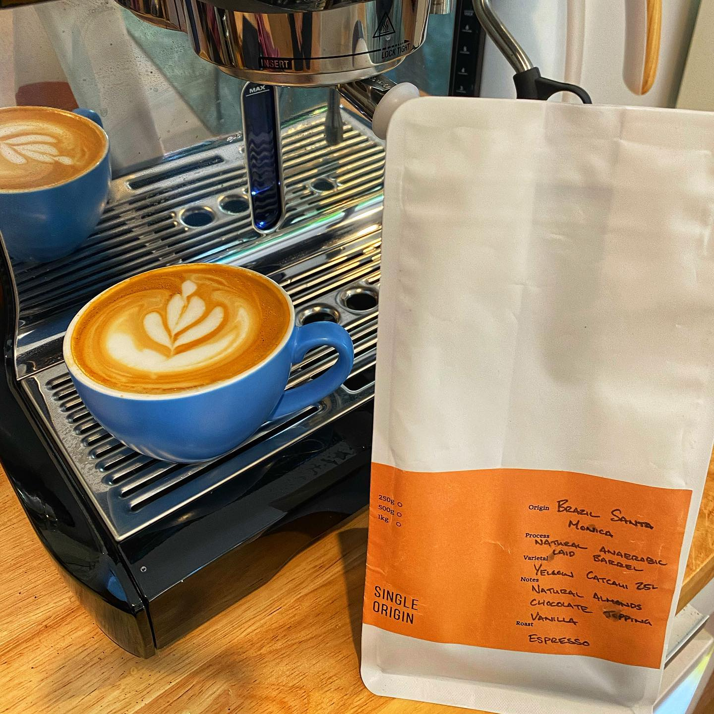

It’s been a minute….

I dropped by @blacksheepcoffeebrisbane last week to meet somebody and they had their Brazil Santa Monica on rotation. 

It’s a Yellow Catuai with a Nautral anaerobic barrel process. Sounds fun huh?

I wanted something to drink with milk because I’ve been playing with a very light roasted Ethiopian that definitely will not be great for that. 

This has tasting notes of almonds, chocolate, and vanilla. I got chatting to the staff at the roastery and got told it’s “like a Ferraro Rocher”. If that’s not the perfect thing to have in the house over Easter I don’t know what is!

And that’s exactly what it is like. I have a 500gm bag of this to go with the hot cross buns and chocolate over the next few days. It’s perfect. 

I did find I needed to up the dose a little to get it to cut through the milk. I usually do a 19gm shot at home, but this works best when I put 22 in there. 

But this is a great comforting coffee to spend Easter with.

