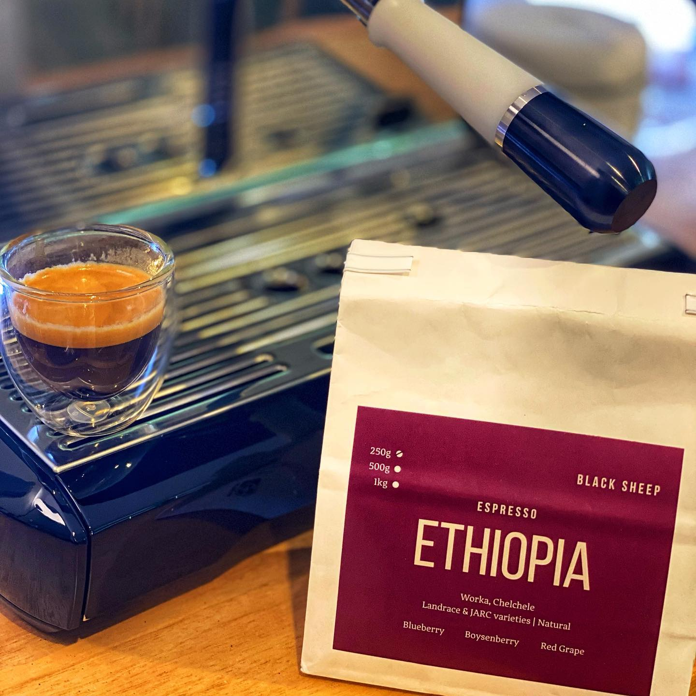

Today I have another coffee from @blacksheepcoffeebrisbane . This is a natural coffee from the Worka Chelchele washing station in Ethiopia. 

As you’d expect it has the juicy berry notes you want, plus a red grape aftertaste. It’s a really nice balance. 

It took me a few goes to get this one right, but I found it worked best pulled a little fast at a 1:2.5 ratio. I’m definitely losing a bit of sweetness with the Niche grinder, I just know there’s some really nice brightness to be had with a nice set of flat burrs. 

Definitely calling this one another win from Black Sheep.

