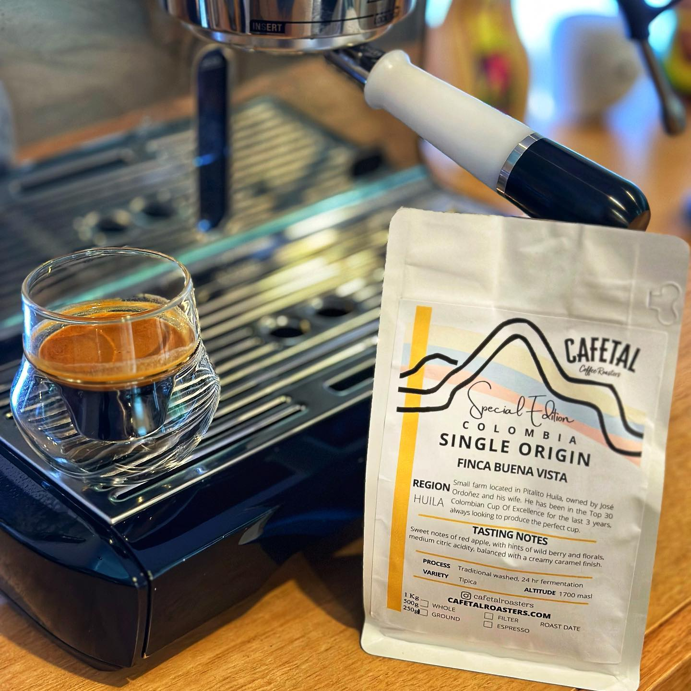

This is another coffee from Brisbane’s @cafetalroasters. The Finca Buena Vista. 

This is a Tipica varietal from Jose Ordoñez’s farm in Huila. It’s washed with a 24 hour fermentation process. 

This is a style I really like as an espresso. A sharp, red apple bite followed by a sweet berry aftertaste. Perfect. 

I tried it with milk too, it’s nice, but all the goodness is entirely lost. 

But as a late morning doppio. Perfect!

