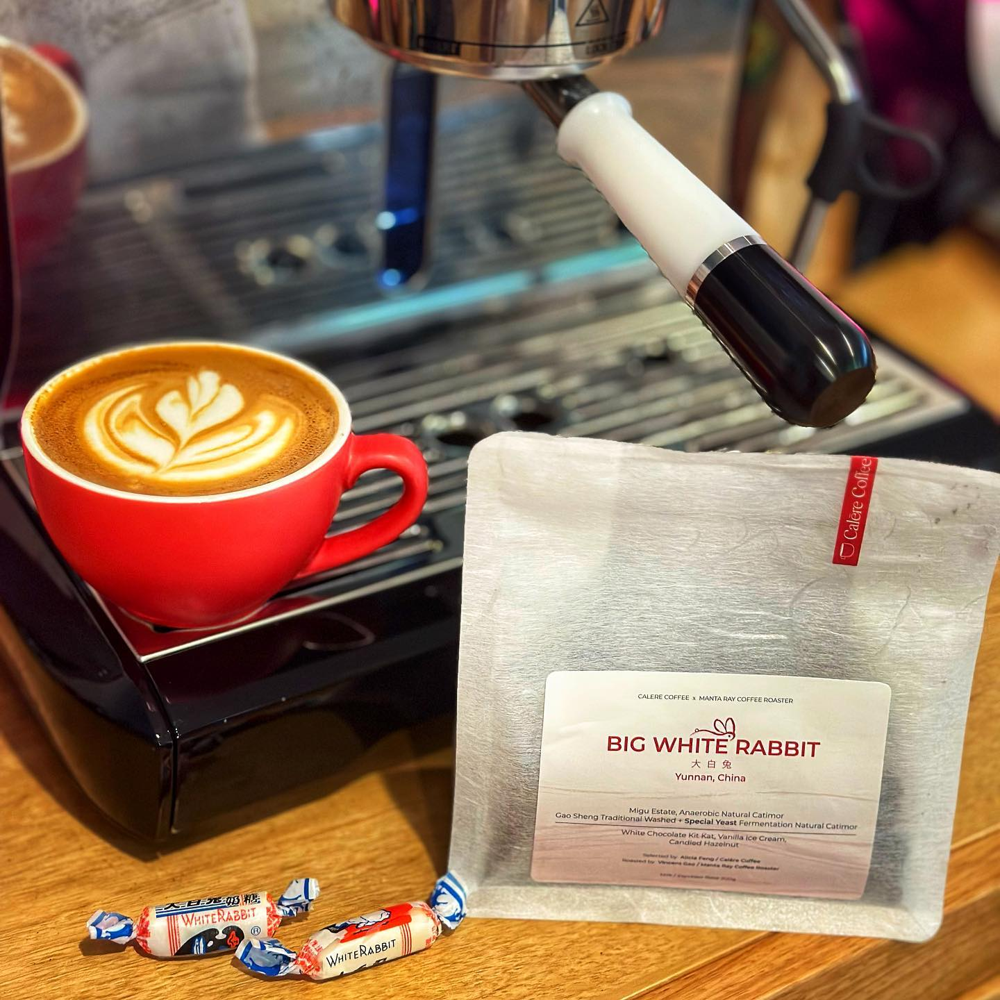

I have found the ultimate comfort drink! This is Big White Rabbit from Melbourne’s @calerecoffee.

It is the Year of the Rabbit after all, and taking some inspiration from White Rabbit candy, Calare have put together this blend that is, in their words, “a milky banger”. 

The blend is three coffees Calare have sourced from Yunnan. 

- Gao Sheng Manor, Traditional Washed Catimor
- Gao Sheng Manor, Special Yeast Fermentation Natural Catimor
- Migu Estate, Anaerobic Natural Catimor Micro Lot Imagination

It comes together in an amazing way. 

The tasting notes of white chocolate Kit Kat is spot on. This is like drinking a hot, vanilla and chocolate milkshake. The funkiness of the fermented natural gives it an awesome maltiness. 

Definitely a fun coffee!

