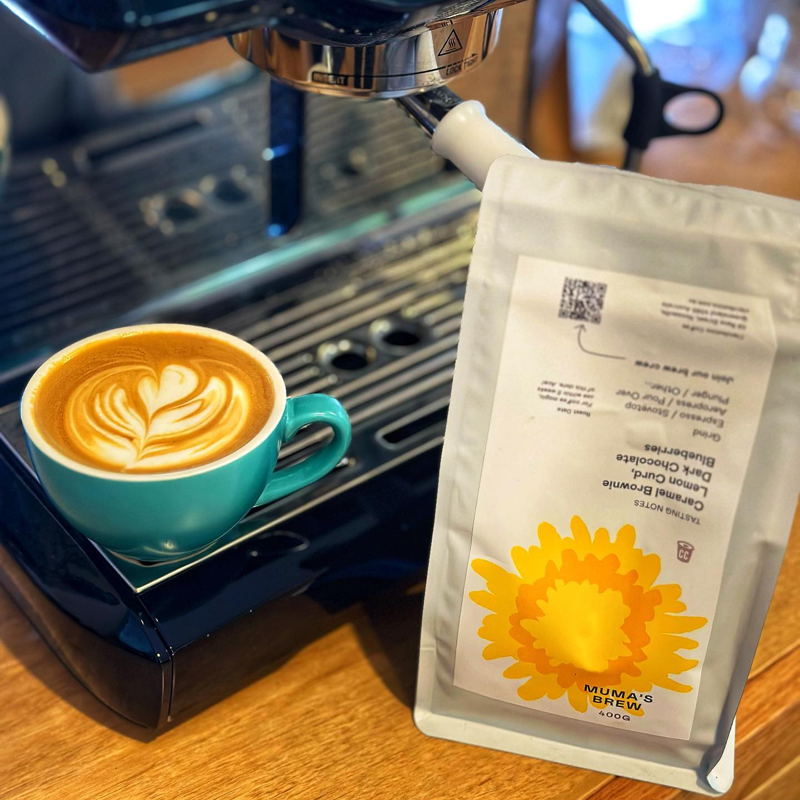
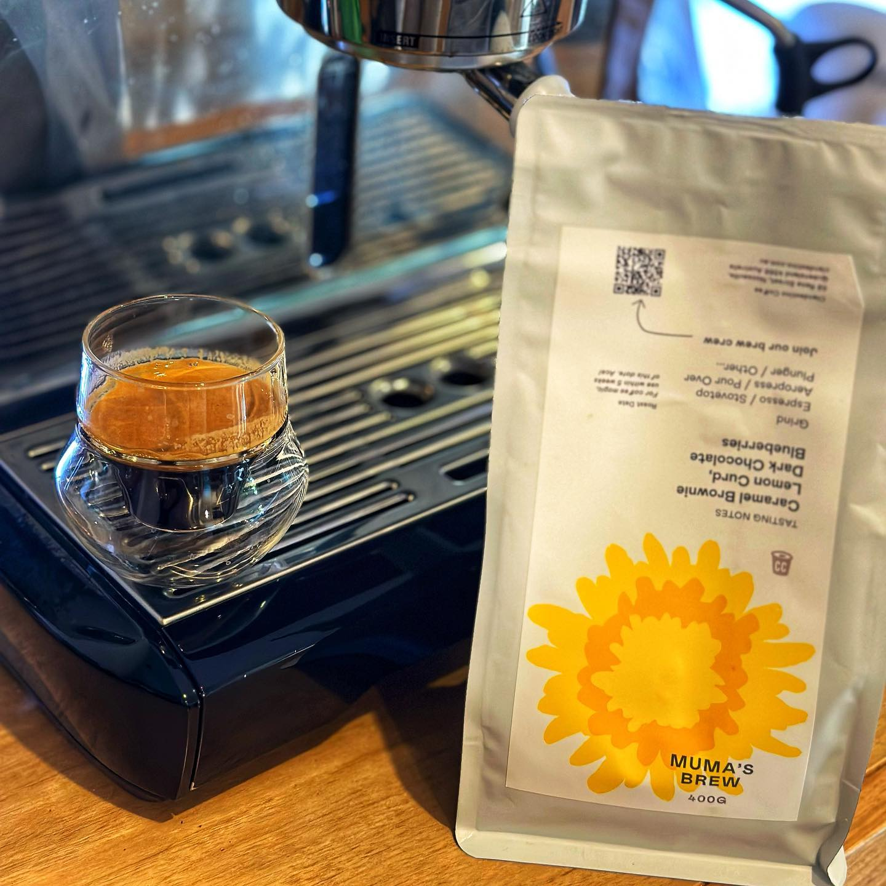

I'm back! It's been a busy few months and I've not had the headspace to write a lot. I've had a few posts sitting in drafts, but I've also been buying bigger bags of some favourites and enjoying those.

This one has been sitting in drafts for a little bit and the coffee is probably not available anymore. But I stopped back at [Clandestino Coffee](https://www.clandestino.com.au/) in Noosa again in early May and they had a Mother's Day blend they called Mumma's Brew!

Every time I stop at Clandestino they have something interesting to try and this one is no different — a fun seasonal blend. It so happened that I had a bunch of driving North from Brisbane over the last few months so I made an effort to take the detour whenever I could.

This coffee has a nice dark chocolate bite to it. It's a creamy, rich brownie flavour on milk and more of a straight chocolate as an espresso. Then comes the berry sweetness, and finally a delicious lemon curd aftertaste which has a nice sour bite to it.

I've not gotten that lemon curd flavour in a coffee before — it's so interesting and works so well in this combination.

Looking forward to my next trip to Clandestino for sure.

[Instagram](https://www.instagram.com/p/CtNRaeXhRfu/)

  
