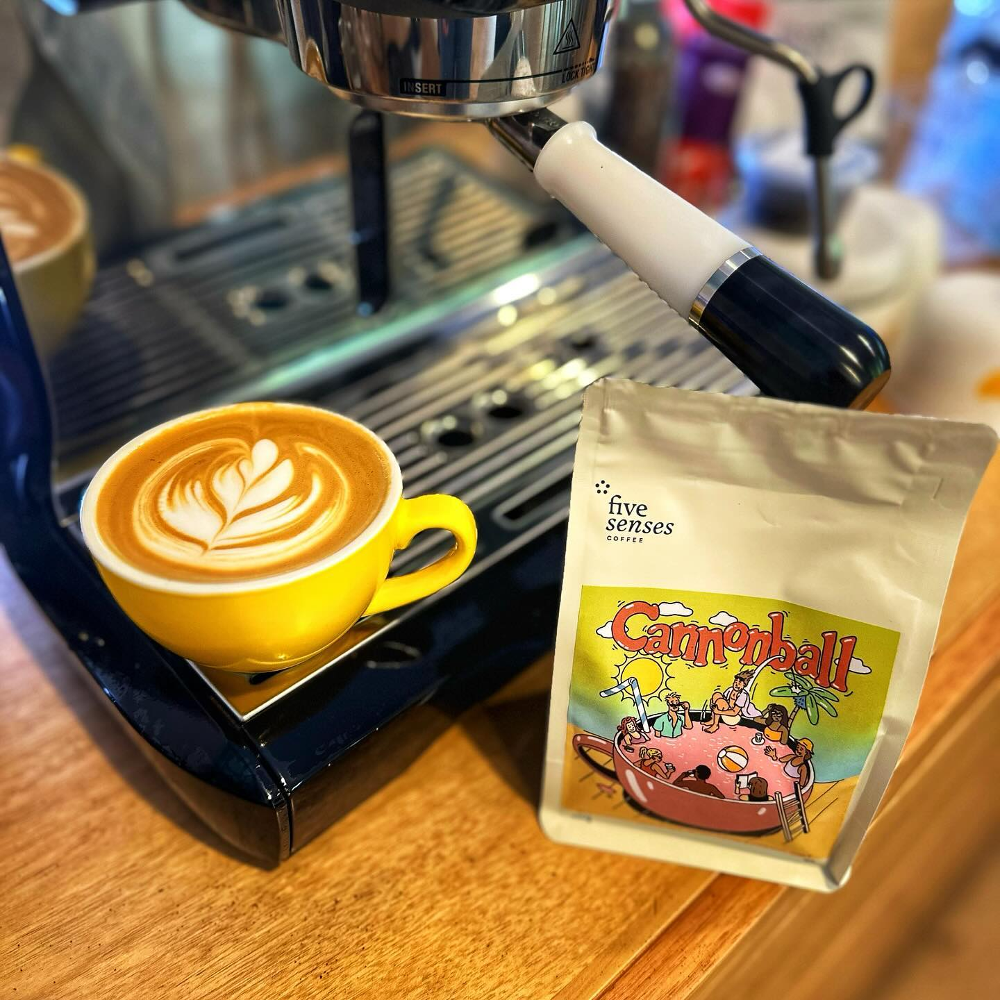

It's been a minute!

I just opened this coffee. Cannonball from [Five Senses Coffee](https://instagram.com/5sensescoffee).

It's a blend of some natural coffees from Ethiopia and Brazil, plus a washed from Papua New Guinea.

The tasting notes are Strawberry Milkshake, Bubblegum, and Creamy Malt. And… well it tastes exactly how it sounds. It's so sweet. Definitely a fun time as a milk coffee.

