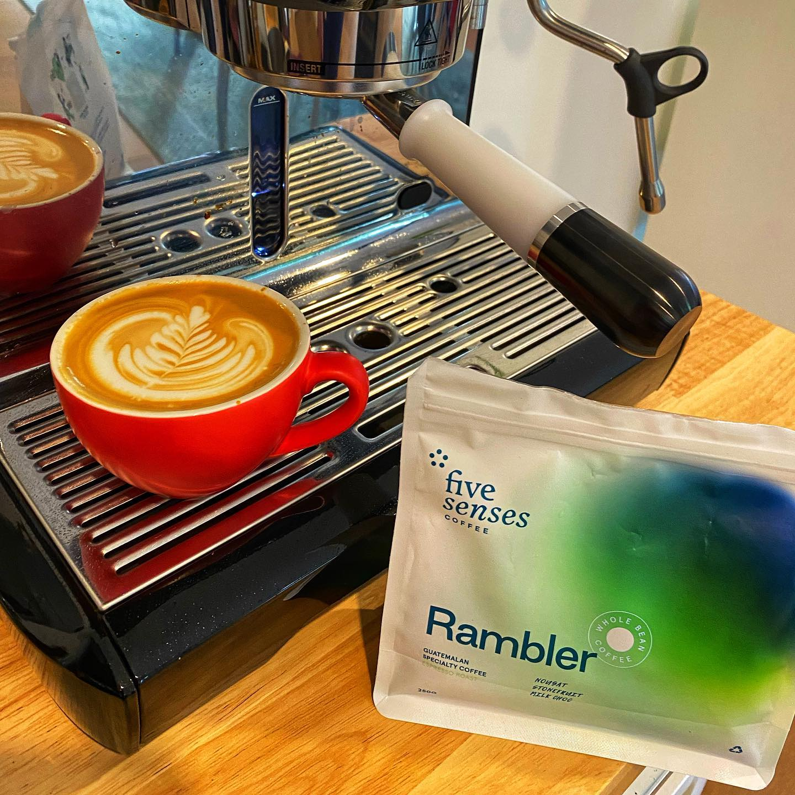

Something a tiny bit different today. I bought this coffee at my local supermarket! 
A few weeks back @5sensescoffee announced a partnership with Coles supermarkets to stock some blends for the home market. 
It’s a good thing for a few reasons, the first is that it puts ethical coffee in a supermarket, and second it can act as an introduction to specialty coffee. 

So of course, I had to try it. 

This is Rambler, a Guatemalan blend. The tasting notes on the bag are Nougat, Stonefruit, and Milk Chocolate. These are flavours I love so I chose it of the three on the shelf. 

Now, because of the logistics of getting it into a store, it was already a month off the roast date (which is printed on the bag!!) by the time I got it. And I’ve been drinking it at a rate closer to the average home coffee drinker (I.e. slower than me). So it’s now almost 6 weeks old. 

It’s roasted a little darker than what I would normally drink, I suspect for the reasons above. 

But. It’s nice 😊 

On milk don’t get a heap of those flavours coming through. Maybe a bit of the chocolate. It’s a solid coffee flavour. As a long black I get a hint of the stone-fruit and nougat. 
Whether that is deliberate, or a factor of how long it sat on the shelf I don’t know. 

But it’s an entirely drinkable coffee and I’ve had far far worse ones at cafes. 

This is a great one to recommend to friends and family looking to buy something at the shops. Or if you mistime your coffee orders and get caught out (it happens!) then this is a handy one to have up your sleeve. 

I love that Five Senses have made this happen. I suspect their next challenge will be educating the public that there is an ethical option on the shelf. They do have a QR code on the bag with links to brew guides and info, which is a nice touch.

