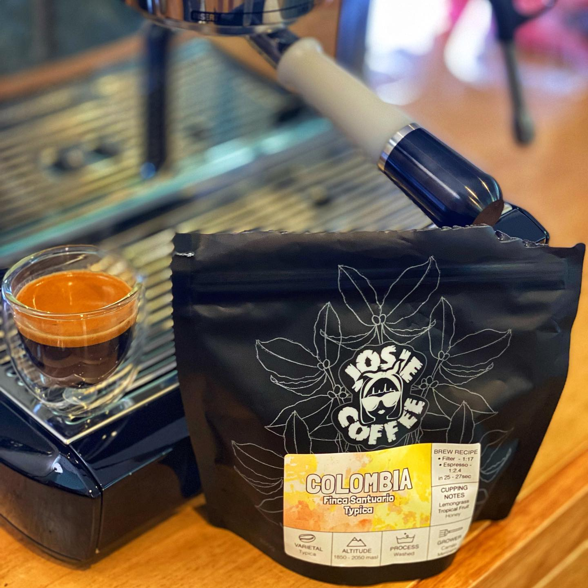

This is a very special coffee from @josiecoffee. The Finca Santuario Typica. 

This washed Colombian is the @espressoclub.coffee coffee of the month for October. It has tasting notes of lemongrass, tropical fruit, and honey. 

I got the lemongrass really strongly once when I’d pulled it a bit fast. When I followed their recipe and poured a 1:2.4 (ish) ratio in 27 seconds at 96 degrees it changed a lot. 

I got a lovely sweet pineapple flavour from it with a warm honey aftertaste. It was amazing. So sweet and fruity. 

As it aged a few more days with the same recipe I got a lot more lemon from it, but I’m sure it was more like a syrupy limoncello type flavour. Delicious. 

Such an interesting coffee. 

I’ve mainly drunk this as straight espresso. I found a long black muted it a little. I’ve not even bothered putting milk on it. 

I think this one is gone now from their website, but I’m going to freeze my last bit of it to come back later, and definitely try more from Josie in the future.

