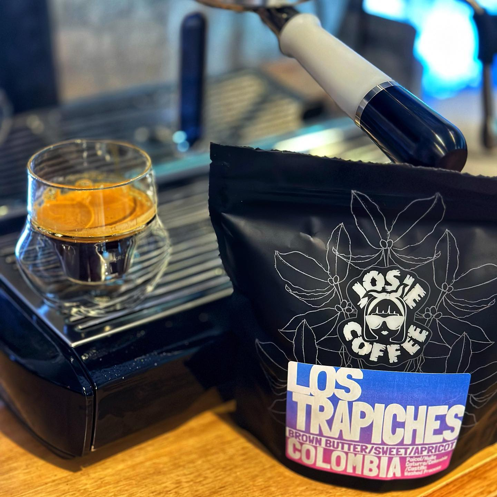

I've been drinking a lot of [Josie Coffee](https://josiecoffee.com.au/) Purple Rain blend lately, I posted about it a while back and it's one I really like.

With my last order I added a bag of the Los Trapiches AA. A washed coffee from Huila in Colombia.

This is a great espresso. I found it needed a slightly longer extraction time — this isn't one for long ratio turbo shots.

But when I got it right it was a big fruity flavour. I got some berries from it and a delicious brown sugar aftertaste.

It gets lost in milk, but as a straight espresso: perfect.

[Instagram](https://www.instagram.com/p/CuJA0vgBBI0/)

