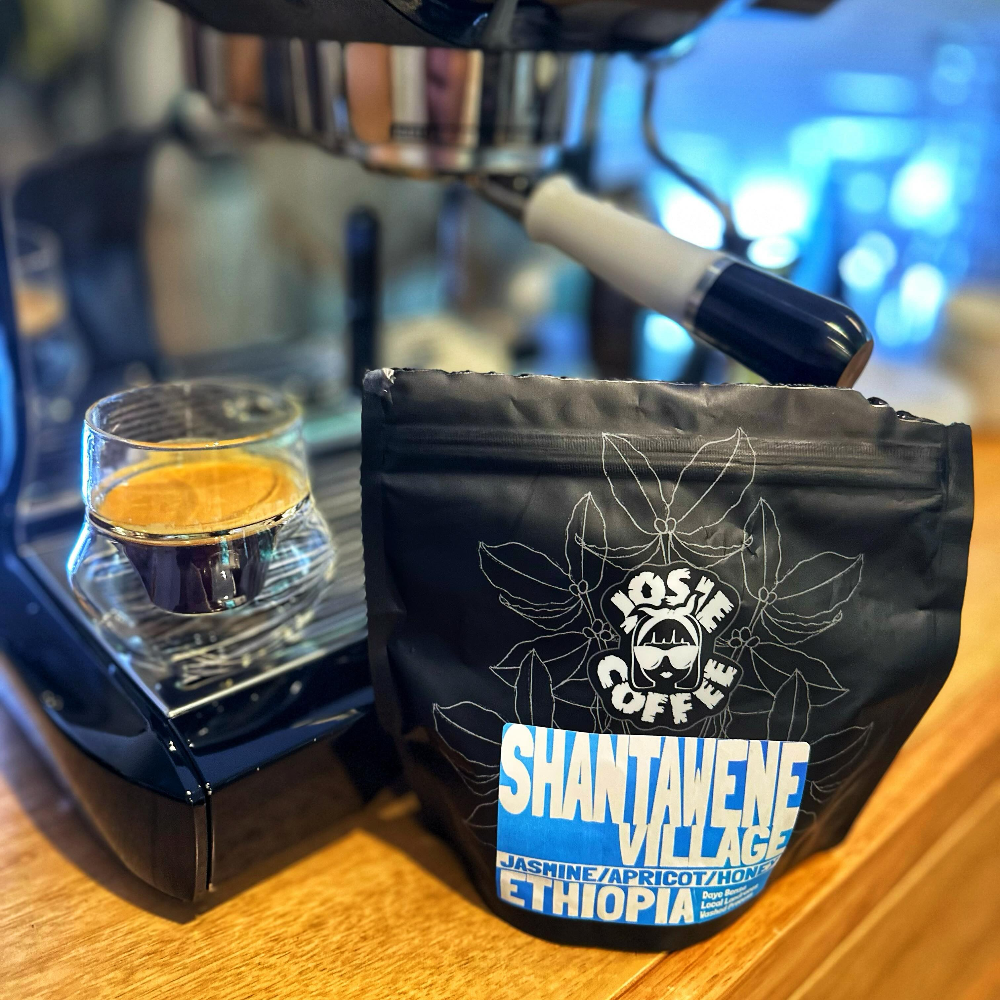

I've been really enjoying this coffee I bought from [Josie Coffee](https://instagram.com/josiecoffee) a few weeks ago.

It's a washed coffee from the Shantawene Village smallholders in the Sidamo region. It's sold out now unfortunately, I grabbed it almost as an afterthought when stocking up on Josie's Purple Rain blend (one of my faves).

It's a few weeks after roast now, earlier on I picked up the very floral notes of Jasmine, as it's aged a little the stone fruit has really come out as well as a nice honey aftertaste.

[Instagram](https://www.instagram.com/p/C4wQ6uNhDjx/)

