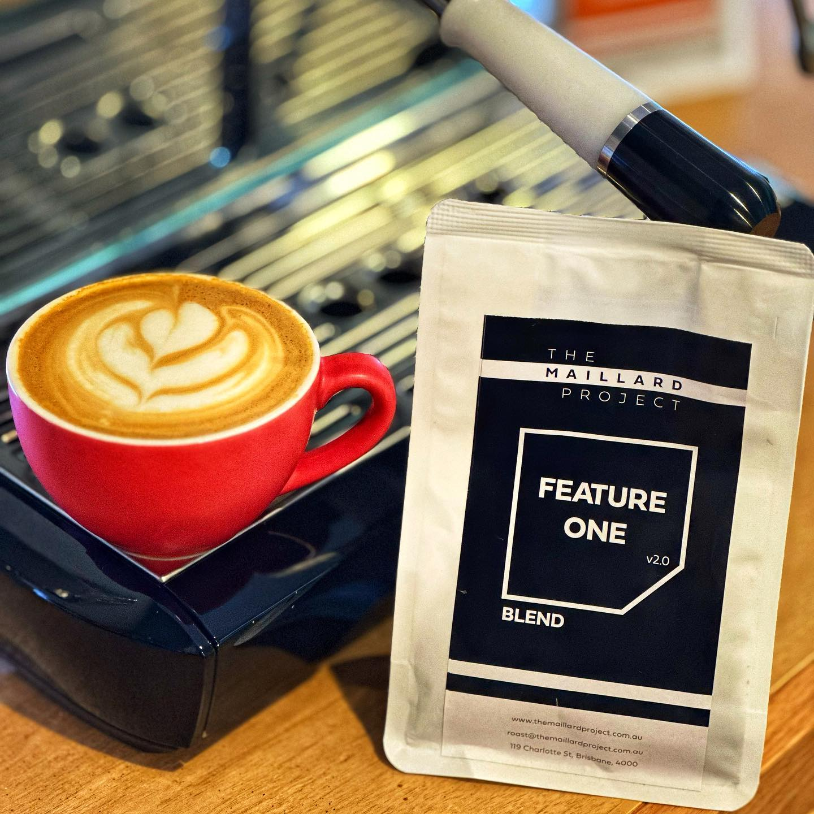

This weeks coffee is an excellent blend from @themaillardproject in the Brisbane cbd. This is the Feature One 2.0, a recently updated blend made up of

40% Brazil Morada Anaerobic Natural
20% Ethiopia Aricha Natural
30% Bolivia Carmelita Natural
10% Colombia La Union Aerobic Natural

I’d the old blend at the cafe a while back and enjoyed it, but the other day I grabbed a takeaway on the 2.0 blend and loved it from the first sip. So of course I grabbed a few bags of beans. 

It’s very different from your usual milk blend. It’s fruity and sweet, with a milk chocolate creaminess and a nice hit of funk. 

I didn’t love this as a black coffee, but as a flat white it’s amazing. 

I’ve served this to a few people at home and it’s gotten a surprised reaction each time. It’s delicious. 

I’m not sure if you can even get this without dropping in to the cafe, but if you’re in Brisbane it’s definitely worth checking out.

