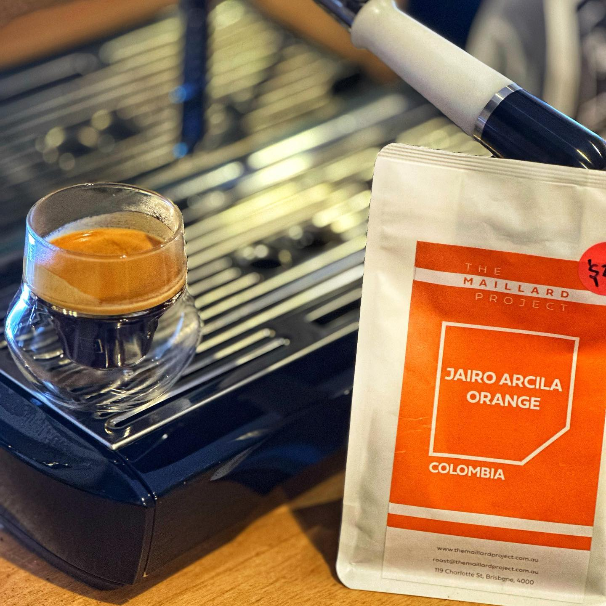

This is another coffee from Brisbane’s @themaillardproject, Jairo Arcila Orange from the Quindo region of Colombia. 

This coffee, from third generation Colombian coffee farmer Jairo Arcila, is a Pink Bourbon which has an anaerobic honey process which involves fermenting the cherries with wine yeast and oranges. 

The result is an amazing tasting coffee with a sweet orange peel flavour to it and a fizzy lemonade finish. It’s not something I’ve had before and I enjoyed it a whole lot.

