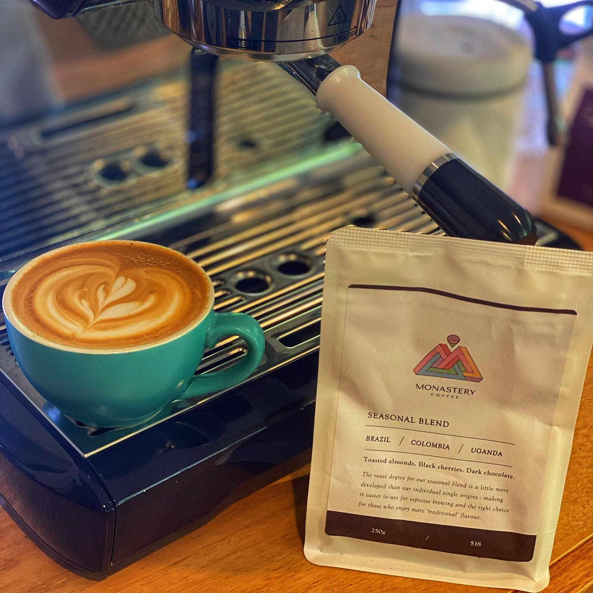

@monasterycoffee are predominantly known for light roasted, single origin coffees. But no catalog would be complete without a blend or two, and this Seasonal Blend is a one that they feel represents what they’d like to drink as a milk (or black) coffee at the roastery.

It’s not a super punchy coffee with milk, by design, it’s a nice smooth flavour with a hint of dark chocolate and plum. 
I had a super interesting chat with @spareshot about the business of wholesale coffee blends and what the market is open to. Which for a lot of roasters means dark, “Strong” roasts without too much fruit or funk. 

I actually really loved this as a straight espresso, the plum came out really nicely. It’s something I’d be happy to drink every day.

This blend is definitely worth a try, put it in your cart next time you order something fancy from Monastery. I really enjoyed it, and if you have people in your life who “don’t like all those crazy fruity coffees” this is a great one to have on hand.

