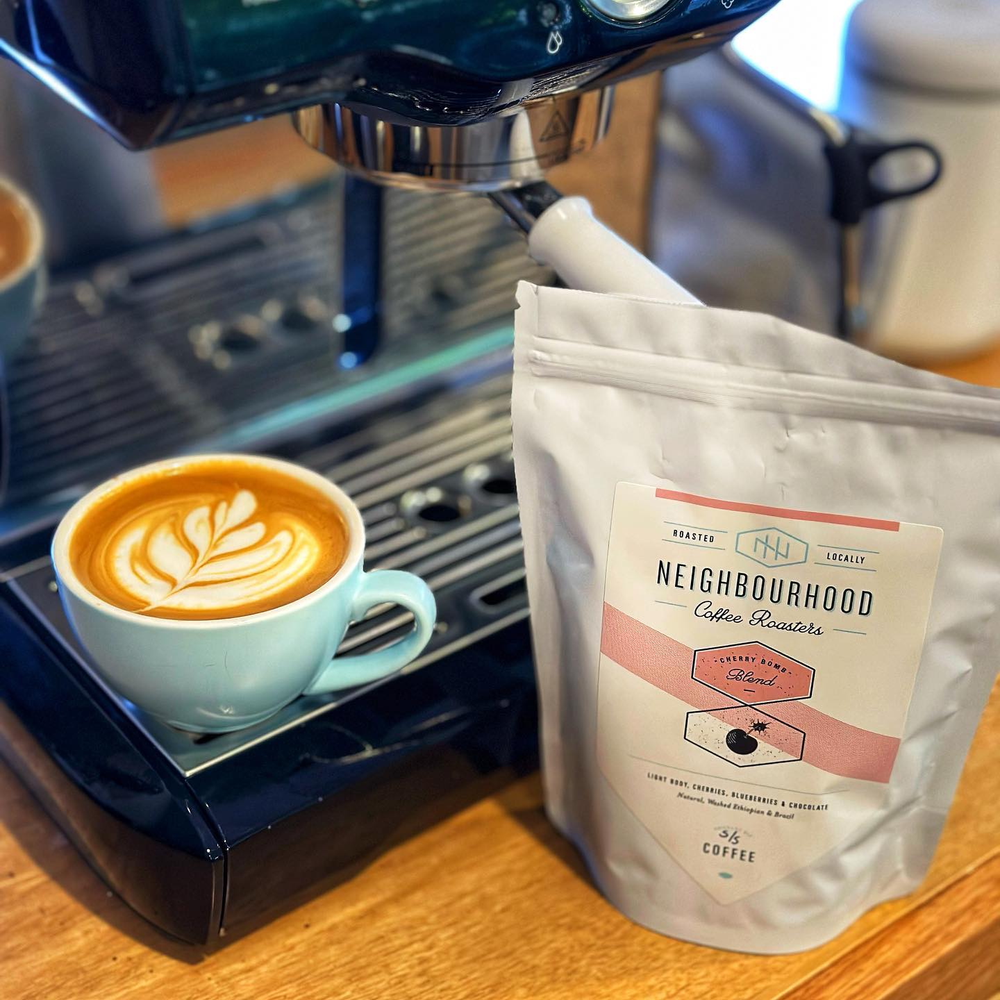
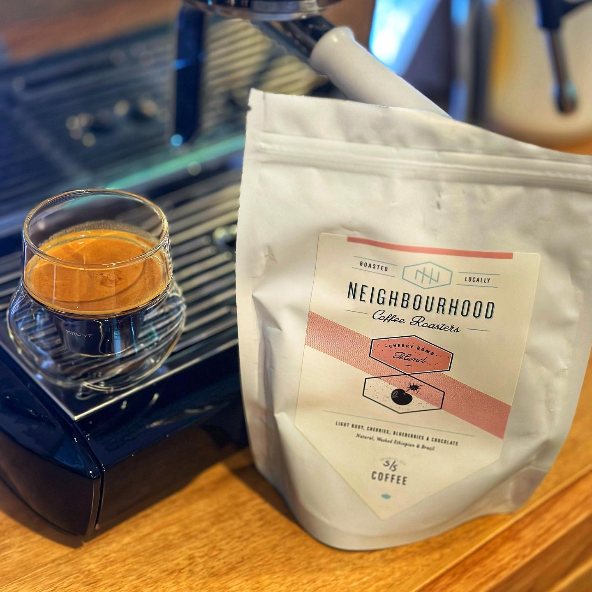

I dropped into Brisbane's [Neighbourhood Coffee Roasters](https://instagram.com/neighbourhoodcoffeeroasters) a few weeks ago — it's a part of town I'm not usually in, so I took the opportunity.

I brought home a bag of their Cherry Bomb blend which is a combination of a Natural bourbon from Brazil, a Washed Yirgacheffe from the Konga station, and a Natural from Sidamo. What a combo.

It has the tart bite of a sour cherry and a sweet blueberry aftertaste, while the Brazil gives it a dark chocolate flavour. It's a really nice combo.

I liked this black and white. Their website also says it's great as a filter or cold brew. I can see how that would work — I might go back and get some more to try that.

[Instagram](https://www.instagram.com/p/CtQIbbrB8OD/)

  
