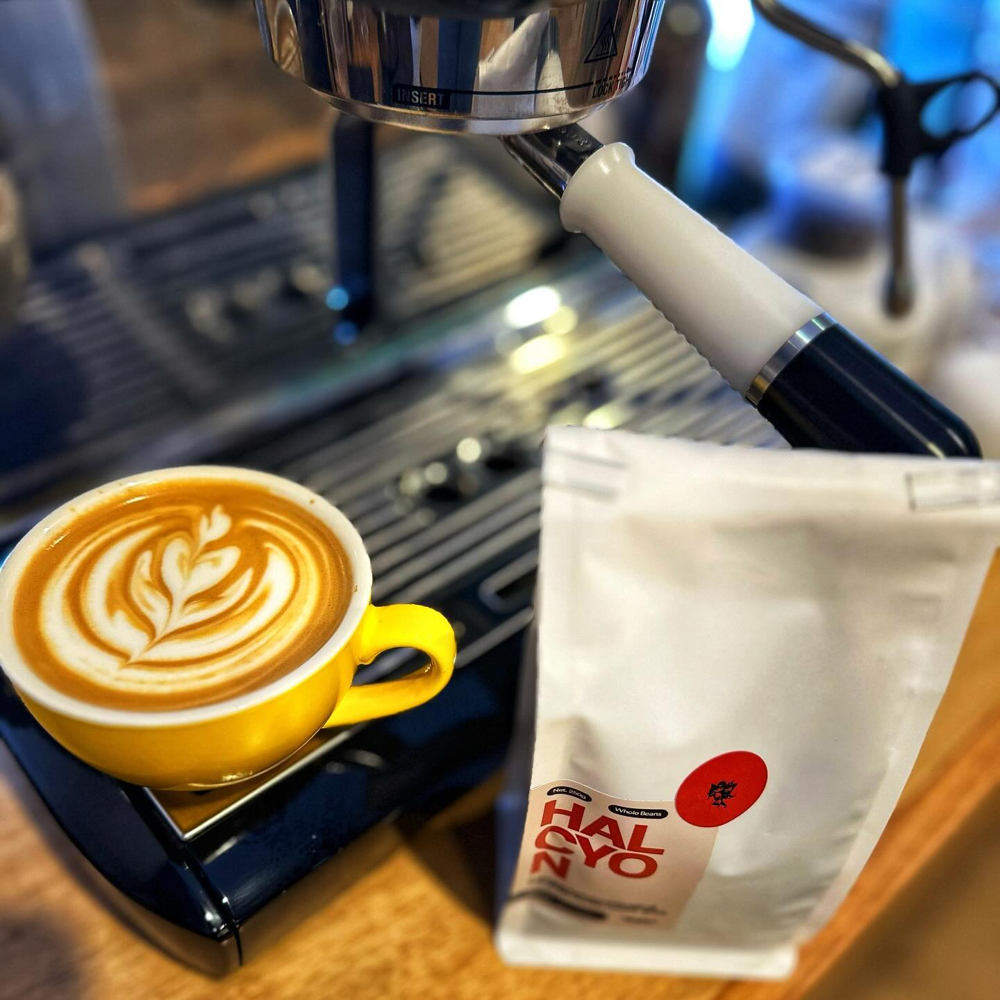
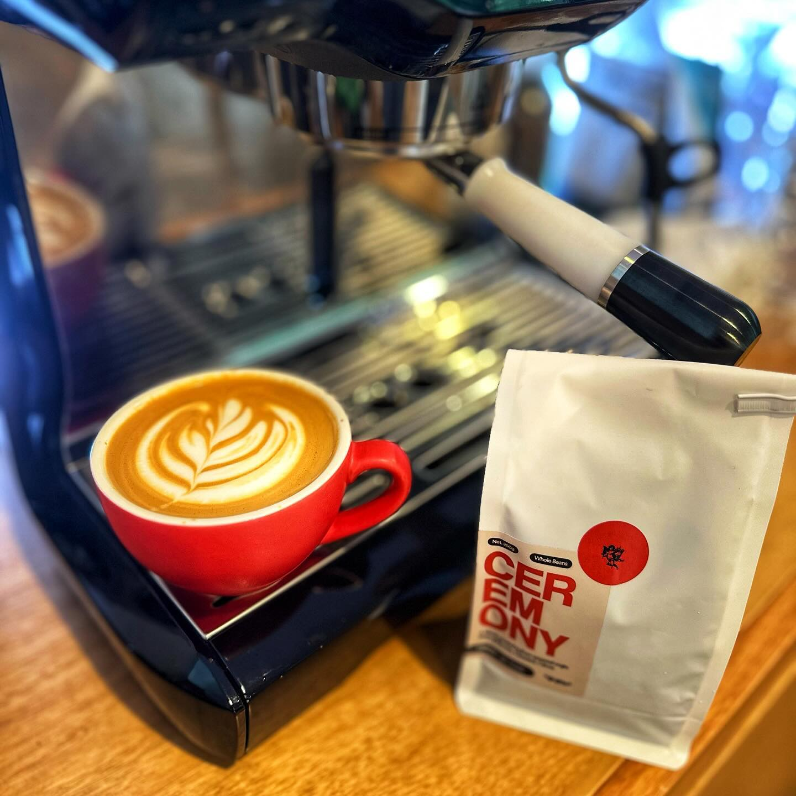
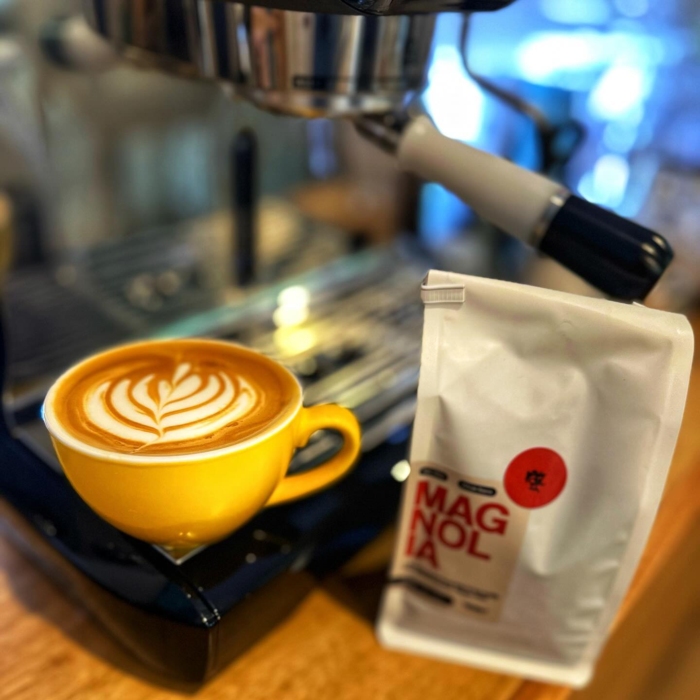

[Omen Coffee Supply](https://omencoffeesupply.com/) is a new label from the head roaster from Brisbane's recently closed Black Sheep Coffee (among a couple of other hats he wears).

Omen offer three different blends, so I took up a Christmas offer to try each of them.

To my taste, the differences between them are pretty subtle, and if you're a fan of medium roasted milk blends you won't go wrong with any of them.

The **Halcyon** has the usual caramel flavours with a nice hint of apricot to it.

**Ceremony** is a fruitier seasonal blend. I didn't actually try this black and I should have, but it's got a nice berry sweetness to it. I'm a sucker for a fruity blend in milk.

Last one is the **Magnolia**. I actually left this a while because based on the notes of low acidity dark chocolate I incorrectly assumed it would be a super dark roast. It's actually not and I really like it. It does have a rich dark chocolate aftertaste, but not at all what I was expecting.

I realise I've not said much that isn't already on the tasting notes, but they are what they say on the tin. All really good blends.

I'm looking forward to trying some of the other offerings from Omen and glad to see this venture kicked off.

[Instagram](https://www.instagram.com/p/C2qYzILBRcD/)

    
