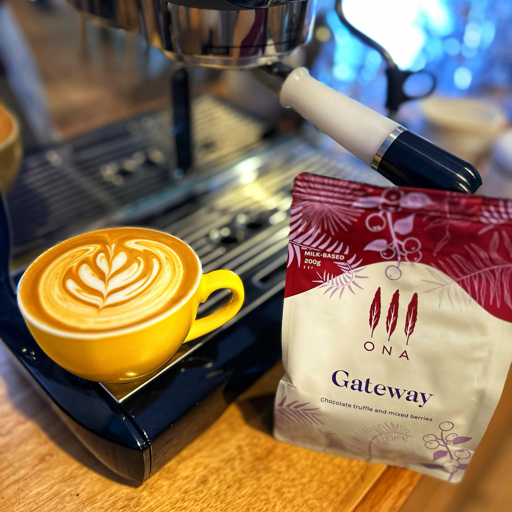

This is the Gateway blend from [ONA Coffee](https://instagram.com/onacoffee). I believe it's their blend that started it all for ONA and used to be called The Founder.

I've had this before a while ago and remember it not standing out for me too much. It was fine, but nothing special.

A few weeks ago I was going through my freezer and found a small sample of it given to me by a friend.

So I ground it and pulled a shot. Unfortunately (I felt at the time) I'd ground it too fine and it poured very slowly. I just cut it off after 40 seconds when it had hit a 1:1 ratio for a ristretto.

And it was delicious!! Funky, sweet, with really lovely berry flavours.

So I ordered a bag of it to see if this wasn't a fluke. And it wasn't. But it really does need a longer extraction time.

So for me, this coffee: 20 in, 20 out, with a longer (40 second) extraction time. Amazing.

[Instagram](https://www.instagram.com/p/C54OSiIh2H0/)

