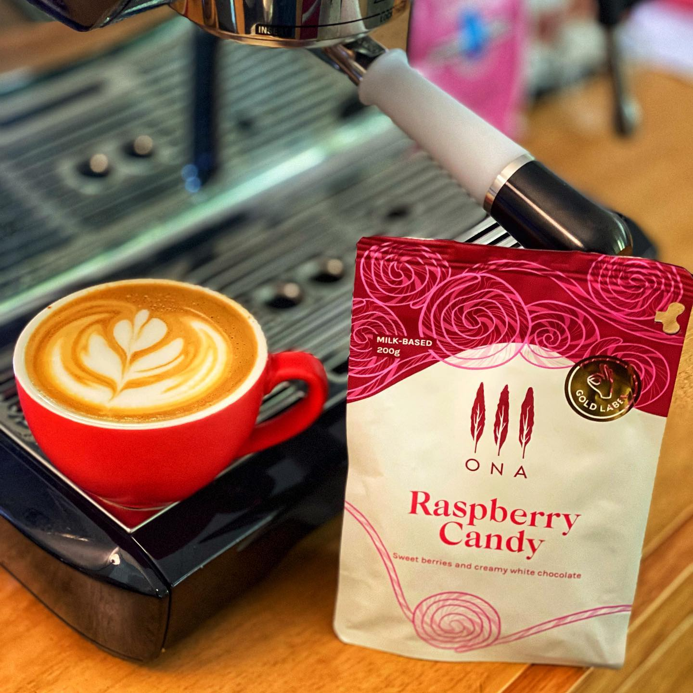

Finally got my hands of a bag of @onacoffee Raspberry Candy again, I’ve had it at home maybe a year ago, but on my older setup.

For those who don’t know it, this is the coffee that Sasa Sestic used to win the World Barista Championships in 2015.

It’s a blend made specifically for milk, and it’s fairly famous for it.

I probably don’t have too much more I add that’s not been written before, but I do like it a whole lot.

It’s sweet, with a delicious creamy raspberry flavour.

Two things I have noticed, the first is this is probably one of those coffees where the Niche Zero doesn’t quite do it justice. The grinder does tend to stumble when you want a really bright, sweet, fruity note. This coffee, along with a few others I’ve had, just is slightly muted when I compare it to a cafe grinding on a commercial grinder. This has me eyeing off EKs!

The second thing I notice is that this is very sensitive to is extraction time. Too long and it loses a lot of sweetness, too short and it’s a little sour. Just around the 29 second mark seems about right for me, but it was also sensitive to puck prep, so tricky to get right.

That said, it’s famous for a reason. Yum.

