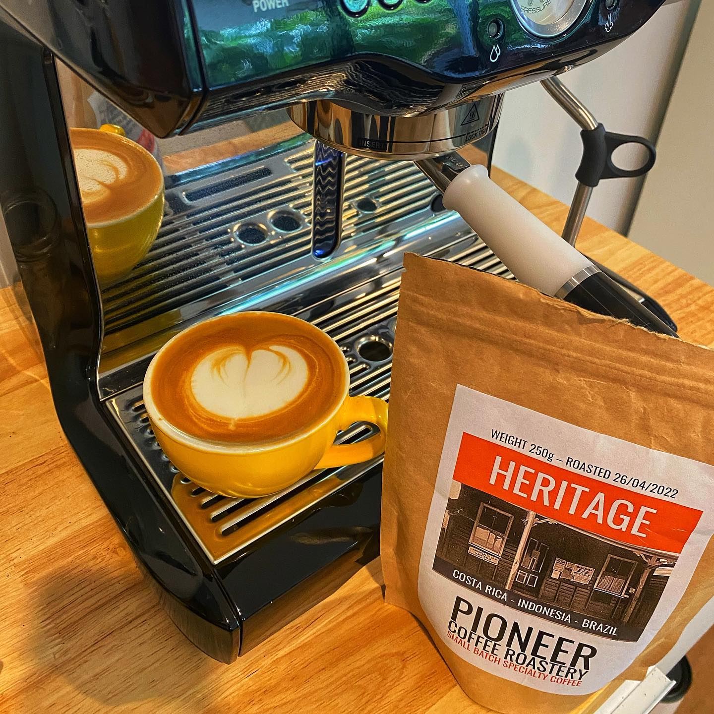

This is the Heritage blend from @pioneercoffeeroastery on Queensland’s Sunshine Coast. My partner was on a road trip and stopped for a break and stumbled across Pioneer and she picked these beans up for me. 

This is a dark dark roast. Has a roast level of 5 on the bag. Not the sort of thing I’d usually buy, but it’s nice to try new things huh!

And it is dark. Entirely different to work with that my usual medium to light roasts I buy at home. But it is dark without being overly bitter, and has a nice nutty, chocolatey taste. It has some stewed plum notes as an aftertaste and an almost boozy lingering flavour. I like it. 

I’ll have to get there on my next trip up that way and try some of their other options. But if you like darker roasted coffee, this is definitely worth a try. 

Unrelated. Have been entirely struggling to pour good milk this week. Everything has come out wrong 🤣

