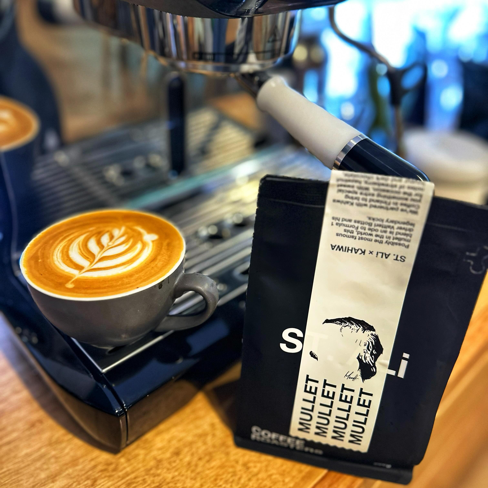

This isn't a coffee I thought I would ever see or try. This is Mullet, a collaboration between Australia's [St Ali](https://instagram.com/st_ali) and Finland's Kahiwa Coffee Roasters.

Kahiwa is owned by F1 racing driver Valtteri Bottas, renowned owner of a mullet, who spends a lot of time in Melbourne because of his relationship with Aussie professional cyclist Tiff Cromwell.

Given I'm also a cyclist and love motorsport, this coffee is relevant to so many of my interests!

St Ali recently acquired one of my local roasteries and I dropped in the other day and found this one.

The coffee is a super interesting blend. It has the dark chocolate you'd expect from a St Ali coffee, but with a sweet fermented and boozy funkiness.

It's like a hot Milo with a dash of brandy — a great winter milk blend.

[Instagram](https://www.instagram.com/p/C6K9oVPhL9r/)

