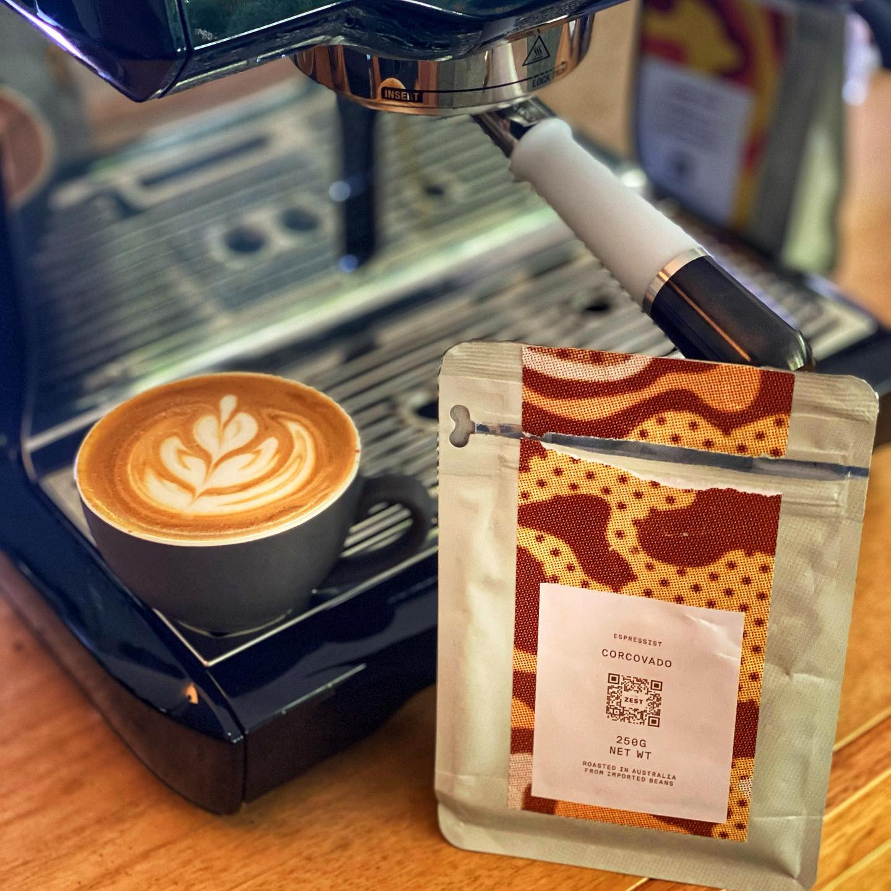

I’ve had people telling me I should try @zest_coffee coffee for months now, and I finally got through my backlog and got a few coffees from them.

The first of these is Corcovado, a fun blend designed to go with milk. It’s blended to give vibes of a Toblerone bar, how could I resist that?

It does it too. 

It’s a blend of  two washed coffees from Colombia and Peru, and a Brazilian natural, and has a nutty, chocolate taste, and a big texture. 

I didn’t love this as a black coffee, which is fine, is specifically designed to be a milk coffee and it does exactly what it says.

If you’re after a fun, comforting, chocolate and nut blend, this is worth trying for sure.

